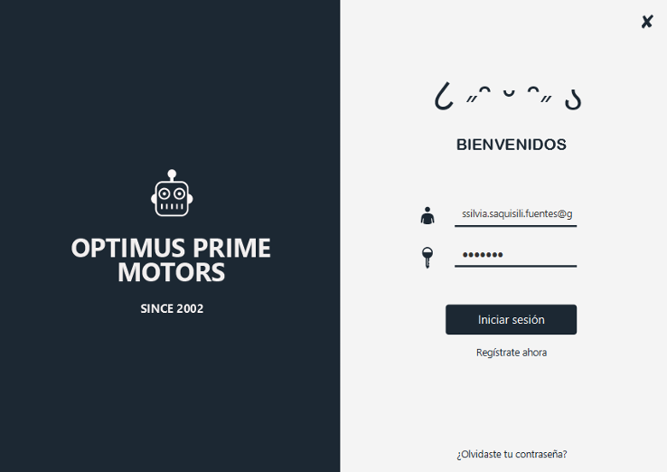
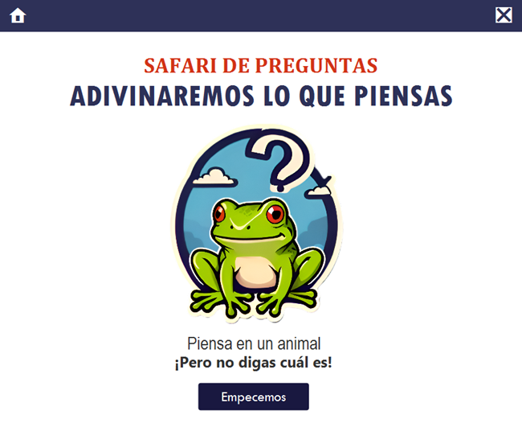
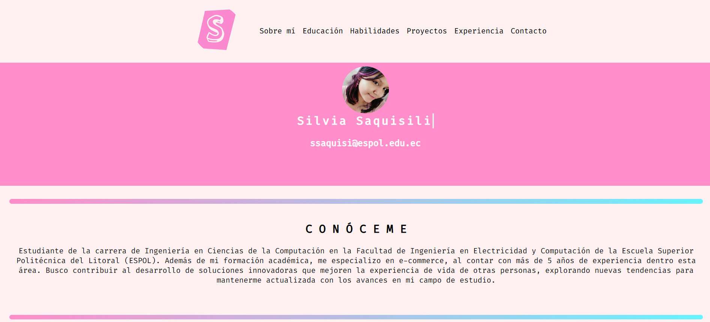

<h1 align="center">
  
</h1>

<h2 align="center">Una apasionada estudiante de la carrera de Ingeniería en Computación</h2>

🌱 Actualmente estoy reforzando conocimientos sobre HTML, CSS, JavaScript, TypeScript y mucho más.

  

📫 Correo electrónico: ssaquisi@espol.edu.ec (en caso de necesitar contactarme).

<h3 align="center">Intereses y curiosidades sobre mí</h3>

🌼 Estudiante de la Escuela Superior Politécnica del Litoral.

👩‍💻 Trabajo a tiempo parcial en varias actividades relacionadas con atención al cliente.

📖 En mi tiempo libre, disfruto ver series de anime y leer mangas.

☕ Amante de la cafeína y el chocolate caliente, especialmente durante una buena conversación.

<h3 align="center">Tecnologías y herramientas utilizadas</h3>

  <em>Algunas de las tecnologías, herramientas, frameworks y librerías mencionadas aquí son utilizadas en diferentes proyectos direccionados al desarrollo de aplicaciones web y móviles.</em>

             

<h3 align="center">Proyectos elaborados</h3>

  | Proyecto | Descripción | Herramientas | Enlace | Vista Previa |
  |----------|-------------|---------------|--------|--------------|
  | Optimus Prime Motors | Programa que simulaba las plataformas de venta y compra de diferentes tipos de vehículos. | Java, JavaFX, SceneBuilder | [Optimus Prime Motors](https://github.com/KevinJSalazar/Proyecto1-Estructuras-Grupo10.git) |  |
  | Safari de preguntas | Juego interactivo donde la máquina trataba de adivinar qué animal estaba pensando el jugador. Y viceversa. | Java, JavaFX, SceneBuilder | [Safari de preguntas](https://github.com/KevinJSalazar/Proyecto2-EstructurasDatos.git) |  |
  | Curriculum Vitae | Página web con información clave de un curriculum | HTML, CSS, Visual Studio Code | [Curriculum Vitae](https://ssaquisi.github.io/curriculum/) |   |
  
  

<h3 align="center">Estadísticas de GitHub</h3>
 

  
  
   
  

  

    <strong><em>Una lección sin dolor no tiene sentido. 
    Eso es porque no se puede ganar algo sin sacrificar algo a cambio. 
    Sin embargo, una vez que hayas soportado el dolor y lo hayas superado, ganarás un corazón que es más fuerte que todo lo demás. 
    Así es, un corazón de acero.</em></strong>

  <em>— Edward Elric</em>

<h3 align="center">Redes sociales para contactarme</h3>

