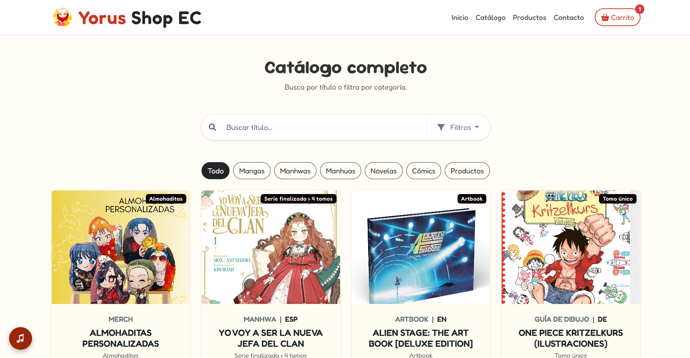
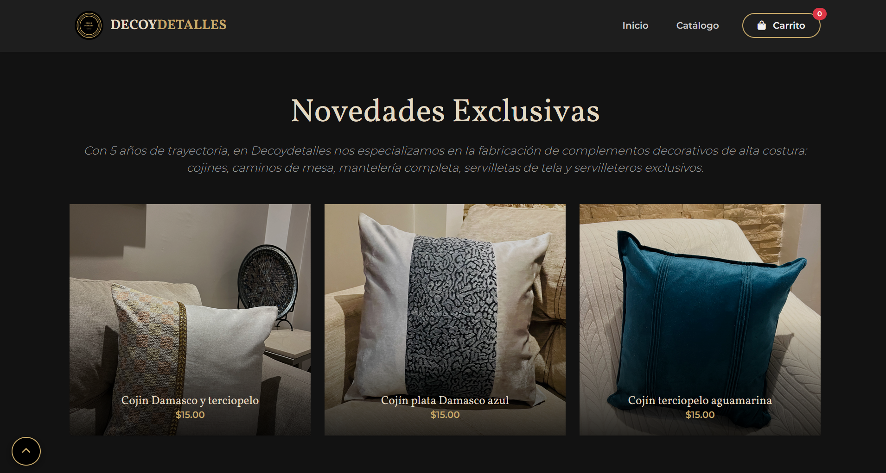
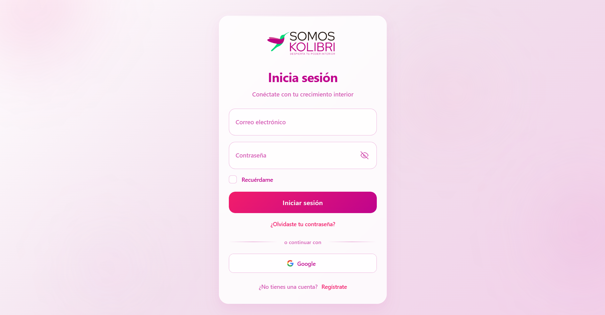

<h1 align="center">
  
</h1>

<h2 align="center">A passionate Computer Science Engineering student</h2>

  
🌱 Currently strengthening my knowledge in <b>HTML, CSS, Vanilla JavaScript, and TypeScript</b>, while exploring <b>Serverless architecture</b> and backend integrations with tools like <b>Supabase</b>.

  
  
📫 Feel free to reach out to me at: <a href="mailto:ssaquisi@espol.edu.ec">ssaquisi@espol.edu.ec</a>

<h3 align="center">ABOUT ME</h3>

🌼 Undergraduate student at <b>Escuela Superior Politécnica del Litoral (ESPOL)</b>.

👩‍💻 Currently expanding my professional experience by interning in software development and working on real-world web solutions.

📖 In my free time, I love watching anime, reading manga, and exploring digital art processing.

☕ A true caffeine and hot chocolate lover—especially when paired with a good conversation!

<h3 align="center">TECHNOLOGIES & TOOLS</h3>

  <em>Here are some of the technologies, tools, and frameworks I use for developing web, mobile, and software applications.</em>

  &nbsp;
  &nbsp;
  &nbsp;
  &nbsp;
  &nbsp;
  &nbsp;
  &nbsp;
  &nbsp;
  

<h3 align="center">FEATURED PROJECTS</h3>

| [Yorus Shop EC](https://yorus-shop-ec.pages.dev/) | [DecoYDetalles](https://decoydetalles-ec.pages.dev/) | [SomosKolibri](https://app.somoskolibri.com/) |
|-----------------------------------------------|-----------------------------------------------|-----------------------------------------------|
| A web catalog for manga, manhwa, novels, and more. It features a custom shopping cart that compiles selected items and forwards the order list directly via Instagram message. Includes an administrative panel for seamless product management. | An e-commerce catalog tailored for high-end decorative accessories (cushions, table runners, and exclusive linens). It features the same intuitive cart-to-Instagram checkout system to streamline customer orders. | A web app featuring user authentication. Users complete a life coaching form that processes their responses to generate a custom PDF. It includes a dashboard to view report history, download PDFs, or email them to the registered account. |
|     |     |     |
|  |  |  |
|  |  |  |

<h3 align="center">GITHUB STATS</h3>
 

  
  
   
  

  

    <strong><em>"A lesson without pain is meaningless. 
    That's because no one can gain without sacrificing something. 
    But by enduring that pain and overcoming it, he shall obtain a powerful, unmatched heart. 
    A fullmetal heart."</em></strong>

  <em>— Edward Elric</em>

<h3 align="center">LET'S CONNECT!</h3>

  &nbsp;
  

